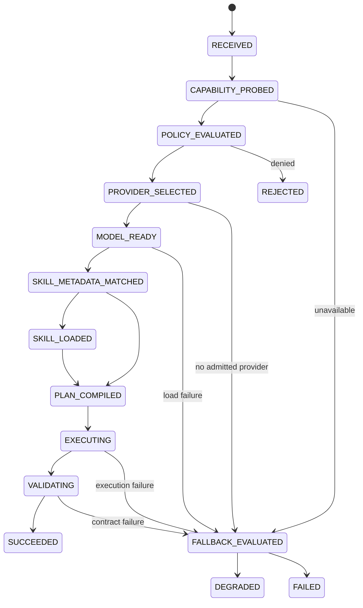
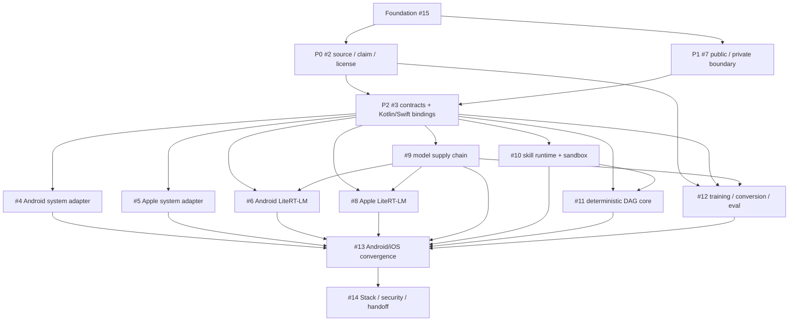

# ai-edge-tlm

A provider-neutral, offline-first foundation for system-provided small language models (SLMs) and app-embedded tiny language models (TLMs) across Android and Apple platforms.

The host application owns policy, planning, permissions, lifecycle, retries, fallback, cancellation, idempotency, side effects, validation, and evidence. A model may classify intent, generate typed values, or propose a bounded plan; it never receives implicit authority to execute arbitrary tools or create an unbounded autonomous chain.

## Foundation publication state

```text
base                  0008d99873f815b23f0bea0c9fca989a20b0637e
implementation commit 51cb2c917a1da54ace87dcef9f4a75bf6504ffac
implementation tree   fc17337b94626c1b8f4c8b83dfbf543bc3134dfd
pull request          #16 / draft / unmerged
changed paths         43 / issue #15 lease only
provider CI           validate #1 / success
local gates           validate PASS / boundary PASS / 16 tests PASS
Shadow                CONTINUE_WITH_WARNINGS_L1
```

The implementation commit/tree is immutable evidence. The open PR head is mutable; live GitHub readback outranks embedded status text before mutation, synchronization, review, or completion admission.

## Runtime State Machine



Foundation implements deterministic reference primitives for this lifecycle. Provider/device transitions require their owning workstream's evidence.

## Implementation DAG



A **start edge** closes when a predecessor is readable and its writer lease is free. A **completion edge** closes only when the predecessor's exact-subject receipt exists in the required evidence lane. These edge classes must not be collapsed.

## Request data flow


## Provider boundaries

| Lane | Intended use | Admission rule |
|---|---|---|
| Android system GenAI | OS-supported general on-device tasks | exact SDK/device capability and #4 device receipt |
| Apple Foundation Models | system model, structured generation, tools | exact OS/device/model availability and #5 receipt |
| Android LiteRT-LM | app-owned specialized/offline model | exact runtime/model/tokenizer/backend and #6 receipt |
| Apple LiteRT-LM | app-owned specialized/offline model | exact API maturity/runtime/model/backend and #8 receipt |
| Cloud | explicit future escape hatch | disabled unless a separate policy atom admits network egress |

Provider selection is capability/policy driven. Parameter counts are planning hints, not domain invariants. A requested accelerator is not evidence of the runtime-observed backend.

## Public/private control-plane boundary

Public Git may contain technical contracts, public source references, implementation/evidence states, and GitHub URLs. It must not contain private Google Workspace URLs, commercial intent, unreleased roadmap, private prompt history, private datasets/user data, credentials, cookies/tokens, or model-access grants.

Public agents know only:

```text
CODEXDOC_CONTEXT_ID=CDX-AI-EDGE-001
CODEXDOC_CONTROL_PLANE_URI   # key only; value injected out of band
CODEXDOC_LEDGER_URI          # key only; value injected out of band
```

Until P1 (#7) publishes its resolver contract, root `AGENTS.md` is authoritative. Missing private context is `ABSENT`, never permission to infer it.

## Molecular workstreams

| Atom | Issue | Writer lease | Current state |
|---|---|---|---|
| C0/K0/D0 | [#15](https://github.com/ed3c/ai-edge-tlm/issues/15) | Foundation root/harness/SSOT | `IMPLEMENTED_UNMERGED`, draft PR #16, CI PASS |
| C1 | [#2](https://github.com/ed3c/ai-edge-tlm/issues/2) | `docs/research/**` + P0 validators | `START_READY`, branch `evidence/source-closure` |
| C2 | [#7](https://github.com/ed3c/ai-edge-tlm/issues/7) | public/private boundary interfaces/tests | `START_READY`, branch `control/public-private-boundary` |
| C3 | [#3](https://github.com/ed3c/ai-edge-tlm/issues/3) | `contracts/**` + bindings | blocked by readable P0/P1 outputs; completion awaits receipts |
| A4/A5/A6/A7 | [#4](https://github.com/ed3c/ai-edge-tlm/issues/4), [#5](https://github.com/ed3c/ai-edge-tlm/issues/5), [#6](https://github.com/ed3c/ai-edge-tlm/issues/6), [#8](https://github.com/ed3c/ai-edge-tlm/issues/8) | four provider adapters | blocked by contracts/model/runtime gates |
| A8/A9/K10/E11 | [#9](https://github.com/ed3c/ai-edge-tlm/issues/9)–[#12](https://github.com/ed3c/ai-edge-tlm/issues/12) | model, skill, core, eval | blocked by owning prerequisites |
| X12/D13 | [#13](https://github.com/ed3c/ai-edge-tlm/issues/13), [#14](https://github.com/ed3c/ai-edge-tlm/issues/14) | convergence and delivery | blocked by exact-head upstream receipts |

Detailed live-routing contracts are in:

- `docs/agents/worker-launch-index.md`
- `docs/agents/phase-prompts.md`
- `docs/governance/stacked-pr-index.md`
- `docs/governance/preimplementation-readiness.md`
- `docs/governance/shadow-foundation-checkpoint.md`

## Evidence lanes

`SOURCE`, `STATIC`, `LOCAL`, `LIVE_DEVICE`, `PRIVATE`, and `HUMAN` are independent. A green cheaper-lane receipt cannot promote an unexercised provider, hardware backend, model-quality result, private authorization, merge, or release transition.

Foundation green proves only its exact deterministic subject. It does not prove article/PDF truth, Drive ACLs, domain bindings, native builds, device/provider availability, backend selection, model accuracy, conversion parity, privacy/energy/thermal behavior, production sandbox exploit resistance, terms acceptance, merge, release, signing, or store publication.

## Local checks

```bash
python3 -m venv .venv
. .venv/bin/activate
python -m pip install -e '.[dev]'
edge-tlmctl validate
edge-tlmctl audit-public-boundary
pytest -q
```

The Foundation validator is self-contained and does not consume future-owned `contracts/**`.

## Authority boundary

The Builder is the only implementation writer. Shadow Architect observes architecture/evidence deltas and may return `L0 OBSERVE`, `L1 WARN`, `L2 REVIEW`, or `L3 BLOCK`.

PR #16 remains draft and unmerged. Merge, release/tag promotion, App Store/Google Play publication, signing/provisioning, license/model-terms acceptance, credential/secret mutation, and semantic conflict resolution remain separately authorized Human operations.
