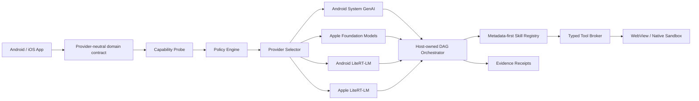
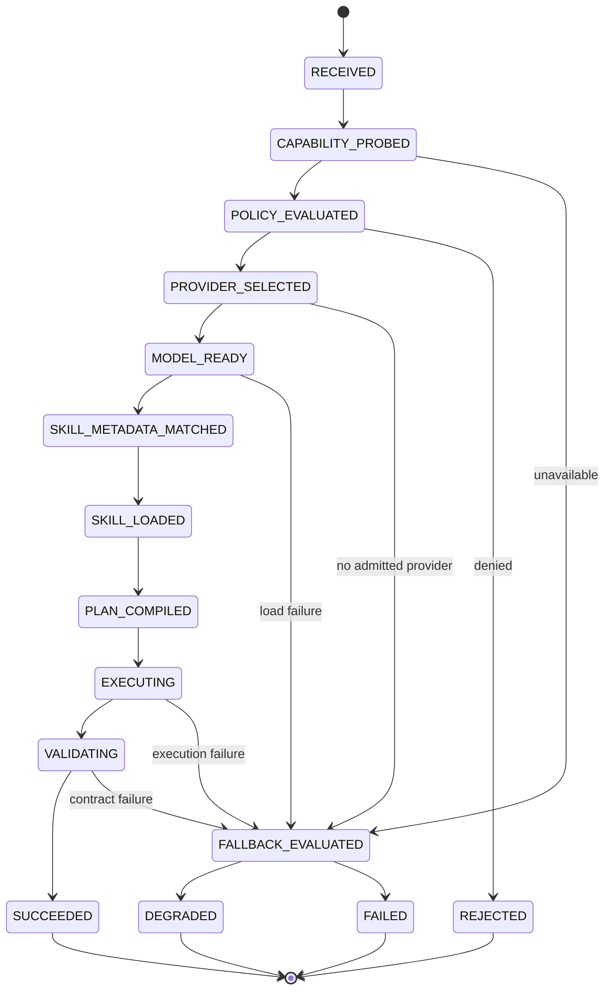
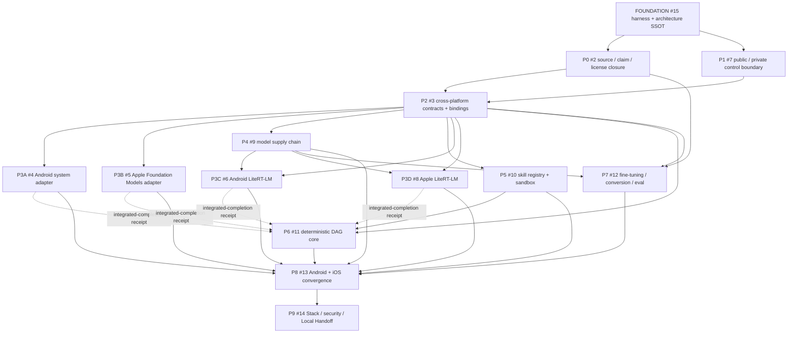
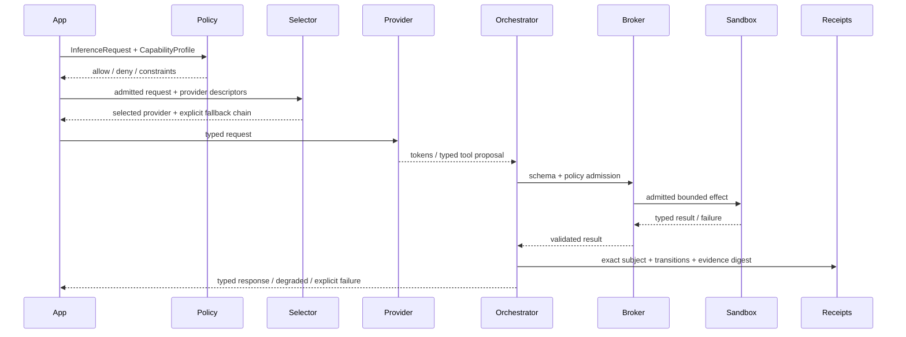

# ai-edge-tlm

A domain-decoupled, offline-first technical foundation for system-provided small language models (SLMs) and app-embedded tiny language models (TLMs) across Android and Apple platforms.

> **Foundation milestone:** this root atom owns architecture SSOT, a self-contained deterministic harness, CI/gates, Agent task/handoff contracts, evidence rules, and the implementation routing graph. Domain JSON contracts, native adapters, model supply chain, skills, training/evaluation, and reference apps are separate molecular atoms and must not be smoothed into Foundation completion.

## Design position

The host application owns policy, planning, permissions, lifecycle, retries, fallback, idempotency, side effects, validation, cancellation, and evidence. A model may classify intent, generate typed values, or propose a bounded plan; it never receives implicit authority to execute arbitrary tools or create an unbounded autonomous chain.



## Runtime State Machine



The runtime diagram is the target domain lifecycle. Foundation proves the deterministic control primitives only; each provider/device transition requires its owning workstream's evidence.

## Implementation DAG



A **start edge** closes when a predecessor is readable and its writer lease is free. A **completion edge** closes only when the predecessor's own exact-subject receipt exists in the required evidence lane. A readable branch or green cheaper-lane test cannot substitute for completion readiness.

### Public issue routing

| Phase | Issue | Primary writer lease | Launch condition |
|---|---|---|---|
| Foundation | [#15](https://github.com/ed3c/ai-edge-tlm/issues/15) | root harness/SSOT/reference primitives | exact base + explicit repository mutation authority |
| P0 | [#2](https://github.com/ed3c/ai-edge-tlm/issues/2) | `docs/research/**` + source/claim/license validators | #15 exact-head admitted |
| P1 | [#7](https://github.com/ed3c/ai-edge-tlm/issues/7) | public/private resolver/boundary surfaces | #15 exact-head admitted |
| P2 | [#3](https://github.com/ed3c/ai-edge-tlm/issues/3) | `contracts/**`, generated Kotlin/Swift bindings | #2/#7 required outputs readable; completion awaits receipts |
| P3A | [#4](https://github.com/ed3c/ai-edge-tlm/issues/4) | `adapters/android/system-genai/**` | #3 frozen contract readable |
| P3B | [#5](https://github.com/ed3c/ai-edge-tlm/issues/5) | `adapters/apple/foundation-models/**` | #3 frozen contract readable |
| P3C | [#6](https://github.com/ed3c/ai-edge-tlm/issues/6) | `adapters/android/litert-lm/**` | #3 + #9 admitted inputs |
| P3D | [#8](https://github.com/ed3c/ai-edge-tlm/issues/8) | `adapters/apple/litert-lm/**` | #3 + #9 + runtime/API maturity gate |
| P4 | [#9](https://github.com/ed3c/ai-edge-tlm/issues/9) | `models/**` | #2/#3/#7 required public contracts |
| P5 | [#10](https://github.com/ed3c/ai-edge-tlm/issues/10) | `skills/**` | #3/#7 contracts |
| P6 | [#11](https://github.com/ed3c/ai-edge-tlm/issues/11) | `core/**` | #3/#10; fake-provider start is allowed |
| P7 | [#12](https://github.com/ed3c/ai-edge-tlm/issues/12) | `training/**`, `eval/**` | #2/#3/#9 admitted |
| P8 | [#13](https://github.com/ed3c/ai-edge-tlm/issues/13) | Android/iOS reference apps | selected scenario parents completion-ready |
| P9 | [#14](https://github.com/ed3c/ai-edge-tlm/issues/14) | aggregate delivery/handoff docs | #13 convergence + live provider readback |

## Request data flow



## Repository ownership map

Foundation publishes only the first group below. Other paths are **planned writer leases**, not Foundation-owned implementation.

```text
FOUNDATION #15 (current root ownership)
├── README.md / AGENTS.md / ARCHITECTURE.md
├── .github/workflows/validate.yml
├── src/edge_tlm/                    # deterministic reference primitives only
├── tests/                           # self-contained Foundation tests/fixtures
├── docs/architecture/
├── docs/agents/                     # generic prompts, packets, handoff rules
└── selected docs/governance/        # evidence, Stack, readiness, publication contract

FUTURE MOLECULAR OWNERS
├── docs/research/                    # #2
├── public/private resolver surface   # #7
├── contracts/ + bindings/            # #3
├── adapters/android/system-genai/    # #4
├── adapters/apple/foundation-models/ # #5
├── adapters/android/litert-lm/       # #6
├── adapters/apple/litert-lm/         # #8
├── models/                            # #9
├── skills/                            # #10
├── core/                              # #11
├── training/ + eval/                  # #12
└── apps/                              # #13
```

## Provider strategy

| Lane | Intended use | Admission rule |
|---|---|---|
| Android system GenAI | OS-supported general on-device tasks | exact SDK/device capability + #4 device receipt |
| Apple Foundation Models | Apple system model, guided generation/tools | exact OS/device/model availability + #5 device receipt |
| Android LiteRT-LM | app-owned specialized/offline model | exact runtime/model artifact/backend + #6 receipt |
| Apple LiteRT-LM | app-owned specialized/offline model | exact API maturity/runtime/model/backend + #8 receipt |
| Optional custom provider | bounded experiment/fallback | new source/license/capability admission; disabled by default |
| Cloud | capability escape hatch | outside the initial offline-first release unless a future explicit policy atom admits it |

Provider selection is capability/policy driven. Parameter-count ranges are planning hints, not domain invariants. Requested acceleration is not evidence of actual backend selection.

## Public/private control-plane boundary

The public repository may contain technical contracts, implementation/evidence states, public source references, and GitHub issue URLs. It must not contain private Google Workspace URLs, commercial intent, unreleased roadmap, private prompt history, private datasets/user data, credentials, tokens/cookies, or model-access grants.

Public agents know only:

```text
CODEXDOC_CONTEXT_ID=CDX-AI-EDGE-001
CODEXDOC_CONTROL_PLANE_URI   # key only; value injected out of band
CODEXDOC_LEDGER_URI          # key only; value injected out of band
```

Until P1 (#7) publishes its resolver contract, the root `AGENTS.md` two-hop rule is authoritative. Private context absence is `ABSENT`, never an invitation to infer it.

## Molecular Stack index

`C/K/A/E/X/D` follows the shared `git-town-stacked-pr-worker` vocabulary. This is a planning index; open heads and local candidates are not durable completion evidence.

| Atom | Issue | Class | True prerequisites | Writer lease | Required lane | Current pre-implementation state |
|---|---|---|---|---|---|---|
| C0/K0/D0 | [#15](https://github.com/ed3c/ai-edge-tlm/issues/15) | root | exact `main` subject | Foundation surfaces listed above | LOCAL_DETERMINISTIC | candidate ready; exact-head publication required |
| C1 | [#2](https://github.com/ed3c/ai-edge-tlm/issues/2) | sibling after root | #15 | `docs/research/**` | SOURCE/STATIC | BLOCKED_BY_#15 |
| C2 | [#7](https://github.com/ed3c/ai-edge-tlm/issues/7) | sibling after root | #15 | public/private boundary | LOCAL/PRIVATE | BLOCKED_BY_#15 |
| C3 | [#3](https://github.com/ed3c/ai-edge-tlm/issues/3) | child/convergence | #2 + #7 | `contracts/**`, bindings | LOCAL | BLOCKED |
| A4 | [#4](https://github.com/ed3c/ai-edge-tlm/issues/4) | sibling | #3 | Android system adapter | LIVE_DEVICE | BLOCKED |
| A5 | [#5](https://github.com/ed3c/ai-edge-tlm/issues/5) | sibling | #3 | Apple system adapter | LIVE_DEVICE | BLOCKED |
| A6 | [#6](https://github.com/ed3c/ai-edge-tlm/issues/6) | sibling | #3 + #9 | Android LiteRT-LM | LOCAL/LIVE_DEVICE | BLOCKED |
| A7 | [#8](https://github.com/ed3c/ai-edge-tlm/issues/8) | sibling | #3 + #9 | Apple LiteRT-LM | LOCAL/LIVE_DEVICE | BLOCKED |
| A8 | [#9](https://github.com/ed3c/ai-edge-tlm/issues/9) | sibling | #2 + #3 + #7 | `models/**` | LOCAL/HUMAN_TERMS | BLOCKED |
| A9 | [#10](https://github.com/ed3c/ai-edge-tlm/issues/10) | sibling | #3 + #7 | `skills/**` | LOCAL | BLOCKED |
| K10 | [#11](https://github.com/ed3c/ai-edge-tlm/issues/11) | child | #3 + #10; adapters for integrated completion | `core/**` | LOCAL + integrated LIVE | BLOCKED |
| E11 | [#12](https://github.com/ed3c/ai-edge-tlm/issues/12) | sibling | #2 + #3 + #9 | `training/**`, `eval/**` | LOCAL/LIVE_DEVICE | BLOCKED |
| X12 | [#13](https://github.com/ed3c/ai-edge-tlm/issues/13) | convergence | selected required receipts | `apps/**` | LIVE_DEVICE | BLOCKED |
| D13 | [#14](https://github.com/ed3c/ai-edge-tlm/issues/14) | delivery/handoff | #13 + live readback | aggregate delivery docs | LOCAL/HUMAN | BLOCKED |

Detailed pre-publication state and launch predicates live in `docs/governance/stacked-pr-index.md` and `docs/agents/worker-launch-index.md`.

## Foundation local development

```bash
python3 -m venv .venv
. .venv/bin/activate
python -m pip install -e '.[dev]'
edge-tlmctl validate
edge-tlmctl audit-public-boundary
pytest -q
```

Foundation `validate` is intentionally self-contained: it verifies the root task packet, deterministic DAG fixture, Local Handoff cardinality, and required SSOT surfaces. It does **not** depend on future `contracts/**`; P2 (#3) owns domain schema and generated-binding validation.

A green Foundation gate proves only the exact local/repository subject in the `LOCAL_DETERMINISTIC` lane. It does not prove Android/iOS buildability, provider availability, physical-device performance, model accuracy, thermal behavior, sandbox exploit resistance, store acceptance, legal/model-term acceptance, or merge/release readiness.

## Source-of-truth rules

1. Official vendor documentation and immutable repository revisions outrank article summaries.
2. Source claims, static/local implementation evidence, physical-device evidence, private-lineage decisions, and Human Admit are independent lanes.
3. Source-code license, model-weight terms, dataset terms, service terms, SDK/store terms, trademark, and export-control review remain separate admission planes.
4. A green cheaper-lane receipt cannot promote an unexercised provider, hardware backend, or Human-owned transition.
5. Merge, release, store publication, model-term acceptance, signing/provisioning, secret mutation, and semantic conflict resolution remain Human-owned.
6. P0 (#2) owns article/source-claim closure; Foundation never copies those claims into implementation PASS.

## Shadow Architect Monitor

The Builder is the only implementation writer. Shadow Architect observes architecture/evidence deltas and returns `L0 OBSERVE`, `L1 WARN`, `L2 REVIEW`, or `L3 BLOCK`. Mandatory checkpoints include architecture choice, first vertical slice, external integration, first green, before commit, before PR/publication, and any runtime failure with design impact.

Current pre-publication readiness and the exact next transition are tracked in `docs/governance/preimplementation-readiness.md`.
