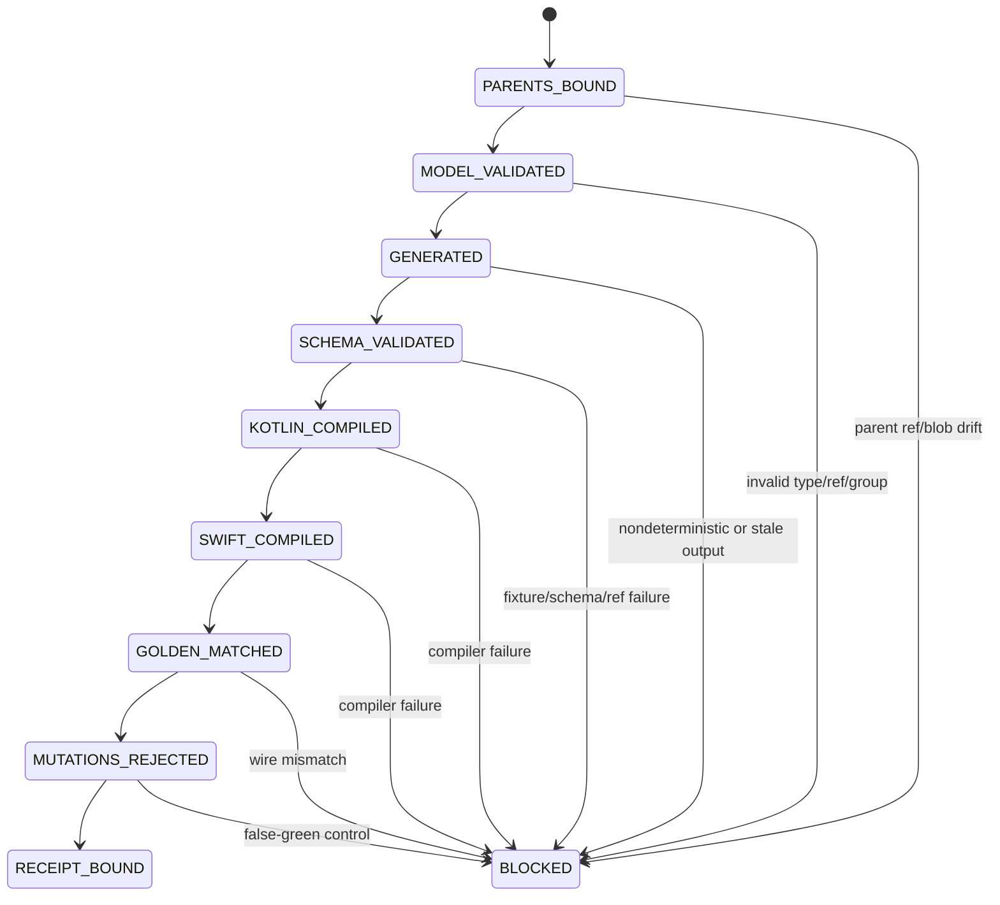

# Cross-platform contracts v1

This directory is the single source of truth for the provider-neutral wire boundary consumed by Android, Apple, LiteRT-LM, model-supply, skill-runtime, orchestration, evaluation, and handoff workstreams.

Provider SDK objects never cross this boundary. The host application remains the authority for policy, permissions, lifecycle, fallback, side effects, validation, and receipts.

## Source and generated surfaces

```text
contracts/model/v1.json
├── contracts/model/enums.json
├── contracts/model/records/{base,inference,tools,orchestration,evidence}.json
└── contracts/model/examples.json
        │
        ▼
contracts/generator/generate.py
├── modular Draft 2020-12 schemas under contracts/schema/**
├── canonical fixtures under contracts/examples/**
├── contracts/compatibility/v1.lock.json
├── modular Kotlin records under bindings/kotlin/**
├── modular Swift records under bindings/swift/**
└── contracts/generated-manifest.json
```

The merged model defines 18 enums, 22 records, five record families, and 10 public root contracts. Generated files must never be edited by hand. One deterministic generator owns every generated byte.

## Contract state machine



## Convergence inputs

P0 is the primary Git parent. P1 remains an immutable task parent and is read through exact public snapshots. Each input is bound by:

1. immutable implementation ref;
2. semantic SHA-256 (`canonical-json` or `raw-bytes`);
3. exact Git blob SHA-1;
4. an authoritative v3 parent receipt;
5. provider CI bound to the verification head.

A changed parent head, semantic digest, Git blob, or snapshot provenance invalidates the P2 task packet.

## Generated contract families

- capability and provider selection inputs;
- model artifact and license-plane identity;
- inference request and streaming events;
- tool definition, proposal, admission, and result;
- immutable skill references;
- bounded execution DAG, retry, cancellation, and fallback;
- benchmark receipts with requested vs observed backend;
- evidence-lane gate results and Local Handoff receipts.

## Local gates

```bash
PYTHONPATH=. python -m contracts.generator.generate --check
PYTHONPATH=. python -m contracts.generator.validate_contracts --require-jsonschema
PYTHONPATH=src:. edge-tlmctl validate
PYTHONPATH=src:. edge-tlmctl audit-public-boundary
PYTHONPATH=src:. pytest -q
bash bindings/kotlin/compile.sh
swift build --package-path bindings/swift --scratch-path /tmp/ai-edge-tlm-swift-build
tests/p2/run_toolchain_golden.sh
```

The dependency-free validator follows the external `$ref` graph emitted by the modular schema bundle. The release gate also runs the reference Draft 2020-12 validator when `jsonschema` and `referencing` are available.

## Evidence ceiling

Passing P2 proves deterministic static contracts and compilation on the recorded local Linux toolchains. It does not prove Android Gradle integration, Xcode/iOS SDK integration, provider availability, model conversion, physical backend selection, model quality, privacy, energy, thermal behavior, private carrier authorization, legal acceptance, merge, or release.
